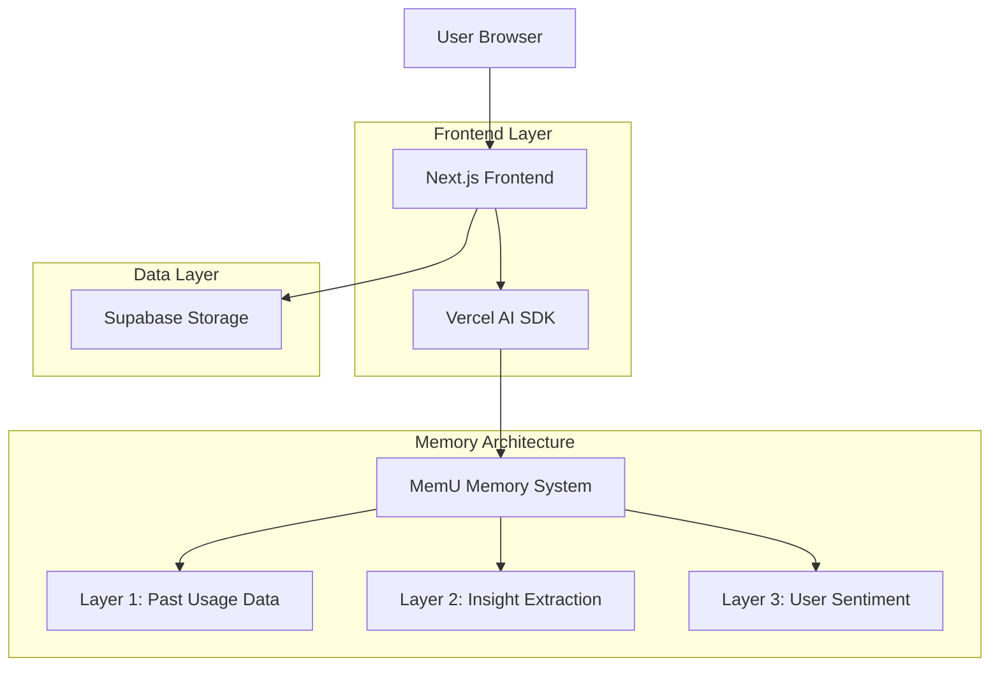
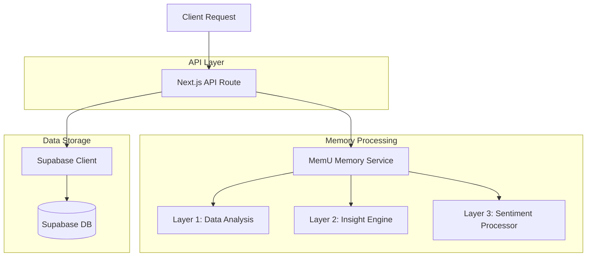
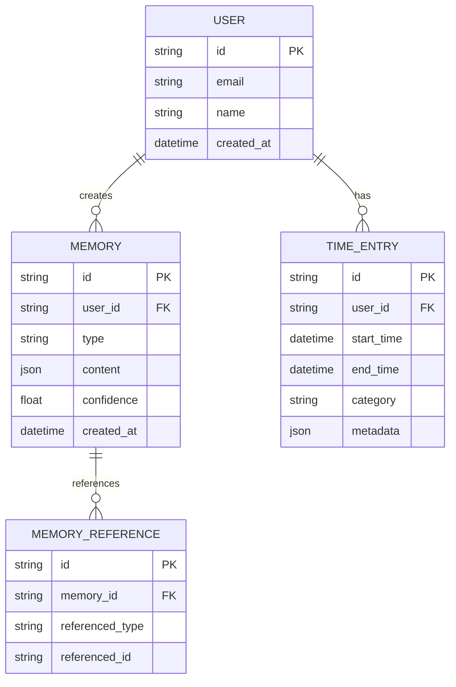

## 1. Architecture design



## 2. Technology Description

* Frontend: Next.js 14 App Router + React 18 + TypeScript

* Initialization Tool: create-next-app

* Styling: Tailwind CSS + Custom CSS with provided color scheme

* AI Integration: Vercel AI SDK with streaming support

* Memory System: Custom MemU implementation

* Database: Supabase (PostgreSQL) for user data and memory storage

* Deployment: Vercel optimized for Next.js

## 3. Route definitions

| Route            | Purpose                                               |
| ---------------- | ----------------------------------------------------- |
| /                | Main dashboard with timeline and chat interface       |
| /api/chat        | Chat API endpoint for MemU interaction                |
| /api/memory      | Memory management API for storing/retrieving insights |
| /api/data/upload | Data upload endpoint for JSON time usage data         |
| /settings        | User settings and memory management interface         |

## 4. API definitions

### 4.1 Core API

**Chat with MemU**

```
POST /api/chat
```

Request:

| Param Name | Param Type | isRequired | Description                      |
| ---------- | ---------- | ---------- | -------------------------------- |
| message    | string     | true       | User's chat message              |
| userId     | string     | true       | User identifier                  |
| context    | object     | false      | Additional context from timeline |

Response:

| Param Name         | Param Type | Description                    |
| ------------------ | ---------- | ------------------------------ |
| response           | string     | AI-generated response          |
| memoriesReferenced | array      | List of memory IDs referenced  |
| thinkingSteps      | array      | Visible thinking process steps |

Example

```json
{
  "message": "When should I schedule deep work?",
  "userId": "user-123",
  "context": {"currentView": "timeline"}
}
```

**Store Memory**

```
POST /api/memory
```

Request:

| Param Name | Param Type | isRequired | Description                     |
| ---------- | ---------- | ---------- | ------------------------------- |
| type       | string     | true       | Memory type (insight/sentiment) |
| content    | object     | true       | Memory content                  |
| userId     | string     | true       | User identifier                 |

## 5. Server architecture diagram



## 6. Data model

### 6.1 Data model definition



### 6.2 Data Definition Language

**Users Table**

```sql
CREATE TABLE users (
    id UUID PRIMARY KEY DEFAULT gen_random_uuid(),
    email VARCHAR(255) UNIQUE NOT NULL,
    name VARCHAR(100) NOT NULL,
    created_at TIMESTAMP WITH TIME ZONE DEFAULT NOW()
);

-- Grant permissions
GRANT SELECT ON users TO anon;
GRANT ALL PRIVILEGES ON users TO authenticated;
```

**Memories Table**

```sql
CREATE TABLE memories (
    id UUID PRIMARY KEY DEFAULT gen_random_uuid(),
    user_id UUID REFERENCES users(id) ON DELETE CASCADE,
    type VARCHAR(50) NOT NULL CHECK (type IN ('insight', 'sentiment', 'chat')),
    content JSONB NOT NULL,
    confidence FLOAT DEFAULT 0.5,
    created_at TIMESTAMP WITH TIME ZONE DEFAULT NOW(),
    updated_at TIMESTAMP WITH TIME ZONE DEFAULT NOW()
);

-- Create indexes
CREATE INDEX idx_memories_user_id ON memories(user_id);
CREATE INDEX idx_memories_type ON memories(type);
CREATE INDEX idx_memories_created_at ON memories(created_at DESC);

-- Grant permissions
GRANT SELECT ON memories TO anon;
GRANT ALL PRIVILEGES ON memories TO authenticated;
```

**Time Entries Table**

```sql
CREATE TABLE time_entries (
    id UUID PRIMARY KEY DEFAULT gen_random_uuid(),
    user_id UUID REFERENCES users(id) ON DELETE CASCADE,
    start_time TIMESTAMP WITH TIME ZONE NOT NULL,
    end_time TIMESTAMP WITH TIME ZONE NOT NULL,
    category VARCHAR(100) NOT NULL,
    metadata JSONB,
    created_at TIMESTAMP WITH TIME ZONE DEFAULT NOW()
);

-- Create indexes
CREATE INDEX idx_time_entries_user_id ON time_entries(user_id);
CREATE INDEX idx_time_entries_start_time ON time_entries(start_time);
CREATE INDEX idx_time_entries_category ON time_entries(category);

-- Grant permissions
GRANT SELECT ON time_entries TO anon;
GRANT ALL PRIVILEGES ON time_entries TO authenticated;
```

## 7. Memory Architecture Implementation

### 7.1 Layer 1: Past Usage Data Processing

* Parse uploaded JSON time usage data

* Normalize and validate data structure

* Store processed data in time\_entries table

* Generate initial statistical summaries

### 7.2 Layer 2: Insight Extraction

* Analyze patterns in time usage data

* Identify productivity peaks and behavioral trends

* Generate insights with confidence scores

* Store insights in memories table with type 'insight'

### 7.3 Layer 3: User Sentiment Processing

* Convert time usage data into pseudo-chat format

* Process through LLM to extract emotional patterns

* Generate sentiment-based memories

* Link sentiments to corresponding time periods

### 7.4 Memory Integration in Chat

* Reference relevant memories during chat interactions

* Show memory layer indicators in UI

* Update memories based on new chat interactions

* Maintain memory confidence scores over time

