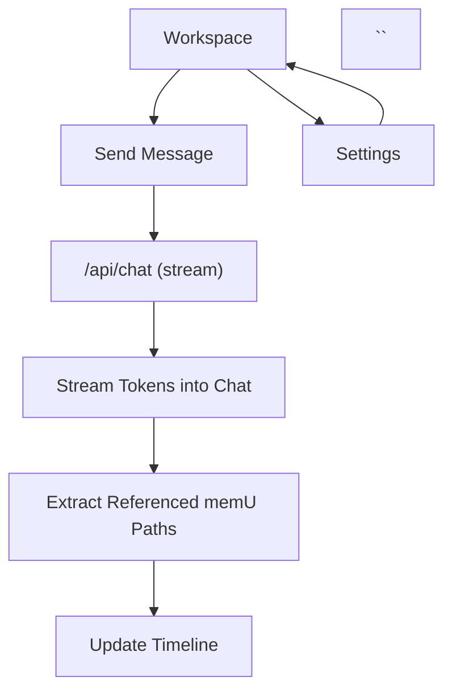

## 1. Product Overview

A Next.js web app with a split view: streaming chat on the left and an activity timeline on the right.
The assistant must not reveal full reasoning; it only surfaces answers plus the referenced “memU paths” used.

## 2. Core Features

### 2.1 Feature Module

Our app requirements consist of the following main pages:

1. **Workspace**: split-pane chat + timeline, streaming responses, referenced memU path display, conversation controls.
2. **Settings**: model/provider selection, memU reference rules, UI preferences.

### 2.3 Page Details

| Page Name | Module Name                 | Feature description                                                                                                                                                                             |
| --------- | --------------------------- | ----------------------------------------------------------------------------------------------------------------------------------------------------------------------------------------------- |
| Workspace | Split layout                | Render desktop-first two-column layout: chat left, timeline right; allow resizing/collapsing timeline.                                                                                          |
| Workspace | Chat transcript             | Display message list with clear roles; render assistant output without hidden reasoning; show “Referenced memU paths” as a dedicated section in each assistant message when present.            |
| Workspace | Streaming                   | Stream assistant responses token-by-token; support cancel/stop generation; handle partial stream gracefully.                                                                                    |
| Workspace | Composer                    | Send user message; support multiline; disable while streaming; allow retry last message.                                                                                                        |
| Workspace | memU reference presentation | Parse assistant output for memU path references; display them as chips/links; prevent displaying non-referenced memU content.                                                                   |
| Workspace | Timeline                    | Append timeline events per turn (user send, assistant start, assistant done, error); show referenced memU paths per turn; allow clicking an event to scroll/highlight corresponding chat turn.  |
| Workspace | Errors & empty states       | Show clear empty state (no messages yet); show API/stream errors with retry action.                                                                                                             |
| Settings  | Model/provider              | Let you choose an LLM provider preset and model name used by the chat API (values validated client-side).                                                                                       |
| Settings  | Reference rules             | Configure the instruction that responses must not include chain-of-thought and must include only referenced memU paths (e.g., “Include a ‘Referenced memU paths’ list; never print reasoning”). |
| Settings  | UI preferences              | Toggle timeline collapsed-by-default; set default split ratio; persist locally in browser storage.                                                                                              |

## 3. Core Process

**Primary user flow**

1. You open the Workspace and type a message.
2. The app sends the message to a streaming chat API.
3. The assistant’s response streams into the chat transcript.
4. The app extracts and renders only the referenced memU paths (as a separate list) and simultaneously updates the timeline with a new event for that turn.
5. You click timeline items to jump to the corresponding chat turn and review which memU paths were referenced.

