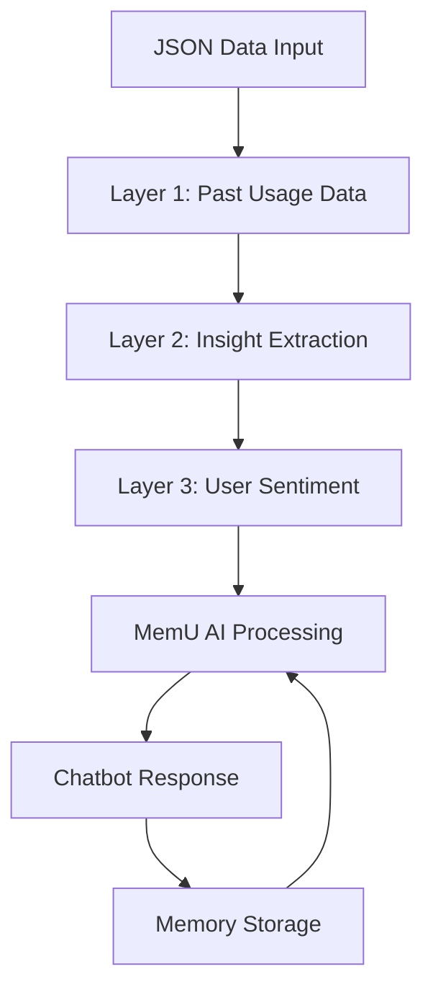
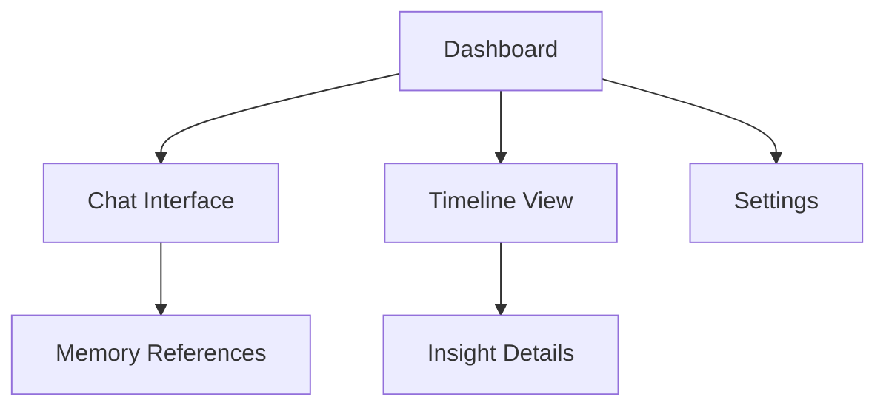

## 1. Product Overview
memuPlanner is an intelligent time planning assistant that learns from your past time usage patterns, extracts insights about your habits, and provides personalized advice for future planning. By analyzing historical data and user sentiment, it creates a memory-driven approach to time management with an interactive timeline and AI-powered chatbot interface.

The product helps users optimize their daily schedules by understanding their behavioral patterns, productivity peaks, and emotional responses to different time usage scenarios.

## 2. Core Features

### 2.1 User Roles
| Role | Registration Method | Core Permissions |
|------|---------------------|------------------|
| User | Email/Social login | Full access to timeline, insights, and chatbot |

### 2.2 Feature Module
Our memuPlanner requirements consist of the following main pages:
1. **Main Dashboard**: Interactive timeline view on the right side showing past time usage patterns and future recommendations
2. **Chat Interface**: AI-powered chatbot on the left side for real-time planning advice and memory interaction
3. **Memory Insights**: Display of extracted insights from past behavior patterns

### 2.3 Page Details
| Page Name | Module Name | Feature description |
|-----------|-------------|---------------------|
| Main Dashboard | Timeline View | Display chronological view of past time usage with color-coded activities and future planning recommendations |
| Main Dashboard | Insight Cards | Show key insights extracted from memory (e.g., "You focus better in mornings") |
| Chat Interface | AI Chatbot | Real-time conversation with MemU showing thinking steps and memory references |
| Chat Interface | Memory Indicators | Display which memories are being referenced during chat responses |
| Settings | Data Import | Upload JSON files containing past time usage data |
| Settings | Memory Management | View and manage stored insights and sentiment data |

## 3. Core Process

### User Flow
1. **Data Input**: User uploads historical time usage data in JSON format
2. **Memory Processing**: System analyzes data through 3-layer memory architecture
3. **Insight Generation**: MemU extracts patterns and generates insights
4. **Interactive Planning**: User engages with chatbot for personalized advice
5. **Memory Learning**: Chat interactions are stored and influence future responses

### Memory Architecture Flow

### Page Navigation Flow

## 4. User Interface Design

### 4.1 Design Style
- **Primary Colors**: Black (#000000), Deep Stone (#3d3c36)
- **Accent Colors**: Gold (#c7b59b), Silver (#d0cecc)
- **Background Colors**: Bone (#edece3), Cream (#fffdf4), White (#ffffff)
- **Layout**: Split-screen design with chat on left, timeline on right
- **Typography**: Clean, modern sans-serif fonts with clear hierarchy
- **Icons**: Minimalist line icons with gold accent highlights

### 4.2 Page Design Overview
| Page Name | Module Name | UI Elements |
|-----------|-------------|-------------|
| Dashboard | Timeline View | Vertical timeline with color-coded activity blocks, hover effects for details, smooth scrolling |
| Dashboard | Insight Cards | Card-based layout with gold borders, subtle animations on reveal |
| Chat Interface | Message Area | Clean white background with cream accents, typing indicators, memory reference badges |
| Chat Interface | Input Area | Rounded input field with gold focus border, send button with hover effects |

### 4.3 Responsiveness
- Desktop-first design with mobile adaptive layout
- Timeline collapses to horizontal scroll on smaller screens
- Chat interface maintains full functionality on mobile
- Touch-optimized interactions for timeline navigation

### 4.4 Memory Architecture Visualization
The memory system will be visualized through subtle UI elements:
- Memory layer indicators in chat responses
- Color-coded timeline segments based on insight confidence
- Animated transitions when new memories are formed