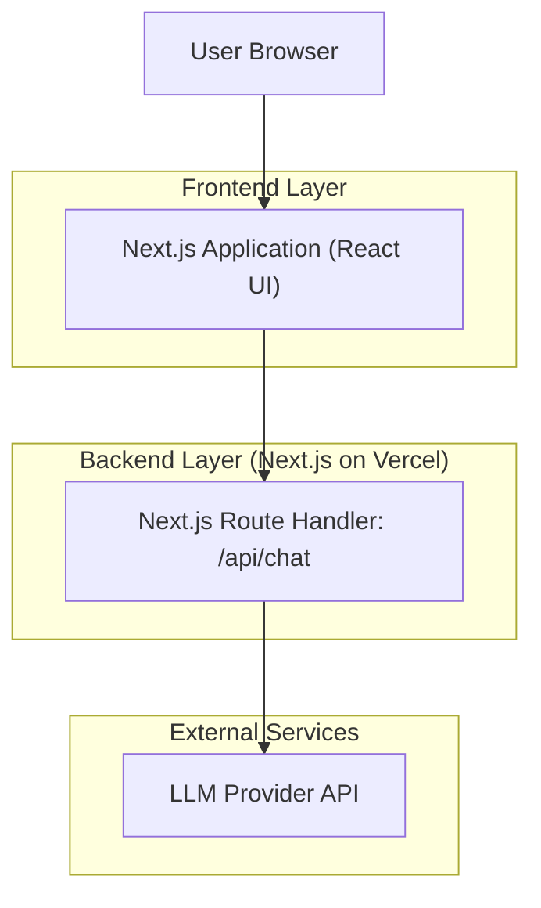
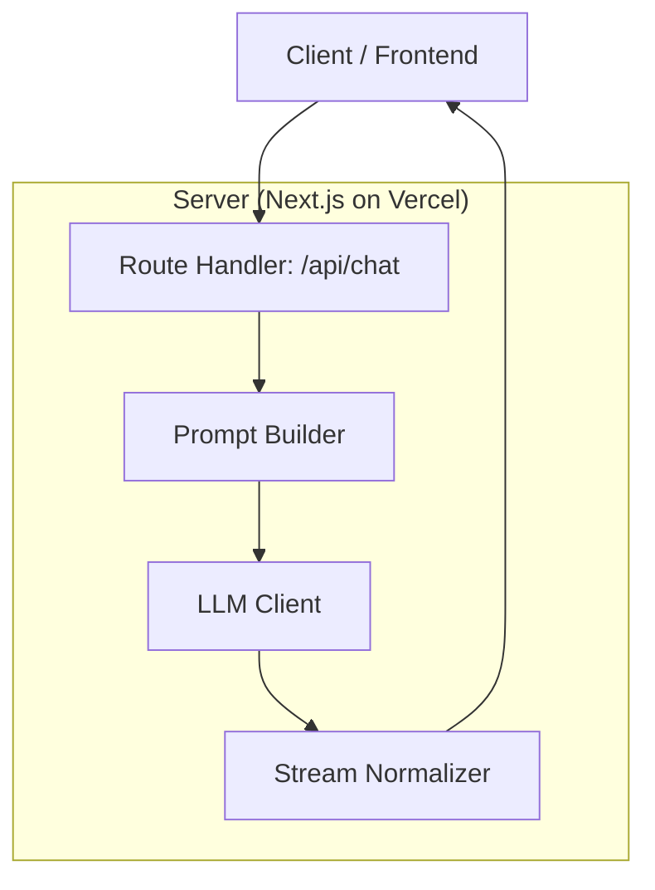

## 1.Architecture design


## 2.Technology Description
- Frontend: Next.js (App Router) + React + TypeScript + Tailwind CSS
- Backend: Next.js Route Handlers (streaming) calling an LLM provider SDK/HTTP API

Notes:
- The LLM API key must be stored in server-side environment variables (e.g., `OPENAI_API_KEY`) and never shipped to the client.
- Streaming should use `ReadableStream` / server-sent streaming responses compatible with Vercel serverless/edge runtimes.

## 3.Route definitions
| Route | Purpose |
|-------|---------|
| / | Workspace page: chat (left) + timeline (right), streaming conversation UI |
| /settings | Settings page: model/provider + reference rules + UI preferences |

## 4.API definitions (If it includes backend services)
### 4.1 Core API
Streaming chat
```
POST /api/chat
```

Request (TypeScript types)
```ts
type ChatRole = "user" | "assistant";

type ChatMessage = {
  role: ChatRole;
  content: string;
};

type ChatRequest = {
  messages: ChatMessage[];
  // Optional: client-provided preferences that are safe to accept
  model?: string;
};
```

Response
- `200` with a streaming body that emits tokens for the assistant message.
- The assistant message format must not include hidden reasoning and must end with an explicit referenced-path list.

Recommended assistant output contract (rendered as text)
```text
<answer text>

Referenced memU paths:
- path/one
- path/two
```

Shared parsing types (client-side)
```ts
type MemuReference = {
  path: string; // e.g., "memU/projects/foo.md" or any repo-like path
};

type TimelineEventType = "user_message" | "assistant_started" | "assistant_completed" | "error";

type TimelineEvent = {
  id: string;
  type: TimelineEventType;
  createdAt: string; // ISO
  turnIndex: number;
  referencedPaths?: MemuReference[];
  summary?: string;
};
```

## 5.Server architecture diagram (If it includes backend services)

